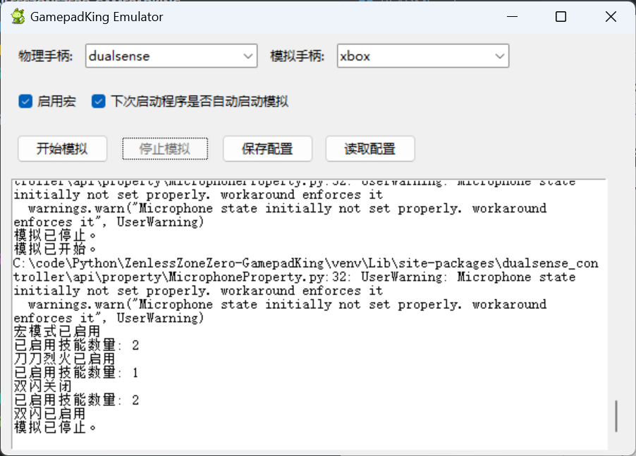

# 绝区零手柄王

通过模拟手柄输入来完成各种一键操作。
因为本脚本使用HidHide了隐藏物理手柄的所有输入,全由模拟手柄转发,所以可以把这个脚本当成手柄转译器,可以在不支持ps5手柄的游戏里用ps5手柄模拟成xbox,或者在不支持xbox手柄的游戏里(大概没有这种游戏😂)用xbox手柄模拟成ps4。
注意：本脚本仅适用于手柄。(推荐使用ps5手柄,本脚本支持用ps5手柄灯光显示脚本状态)

### 程序界面



## 使用方法

- [手动安装(推荐)](#手动安装)
- [自动安装(未完善,目前必须在较好的网络环境下一次安装成功才能用)](#)
- [按键操作](#按键操作)

### 手动安装

1. 安装 [HidHide](https://github.com/nefarius/HidHide/releases/)
2. 克隆存储库：

   ```sh
   git clone https://github.com/ccc007ccc/ZenlessZoneZero-GamepadKing.git
   cd ZenlessZoneZero-GamepadKing
   ```
3. 安装所需库：

   ```sh
   pip install -r requirements.txt
   ```
4. 使用管理员终端运行脚本，仅支持ps5手柄无线重连(一定要先连接好手柄,因为我不知道怎么写重连≧ ﹏ ≦)：

   ```sh
   python main.py
   ```
5. 选择物理手柄类型和模拟手柄类型
6. 开始模拟

### 自动安装

1. 克隆存储库：

   ```sh
   git clone https://github.com/ccc007ccc/ZenlessZoneZero-GamepadKing.git
   cd ZenlessZoneZero-GamepadKing
   ```
2. 管理员权限运行 启动.bat

### 按键操作

  括号内是ps5手柄键位

1. 按下 LT(L2) + 十字键上 键启动或关闭辅助模式(切换时手柄会震动一下)
2. 手柄按 LT(L2) + 十字键左 启用或关闭一键双闪, 按 B(○) 使用一键双闪
3. 按下 LT(L2) + 十字键右 启用或关闭刀刀烈火, 按住 X(□) 使用刀刀烈火

## 常见问题

- 启动脚本后绝区零手柄震动会消失
  xbox手柄请尝试重启脚本,ps5手柄因为模拟成ps4手柄但是绝区零不支持ps4震动所以没有震动,模拟成xbox可以解决.
- 游戏内脚本不生效
  尝试重进游戏,在进游戏前需要先启动脚本
- xboxone手柄有线模式无法使用
  只要连xboxone手柄有线模式hidhide就给不出完整JSON,导致报错,不知道怎么修,技术有限.

## 免责声明

此脚本仅供学习和娱乐使用，请勿用于破坏游戏平衡或其他不正当行为。使用此脚本的风险由用户自行承担。
